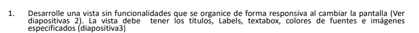
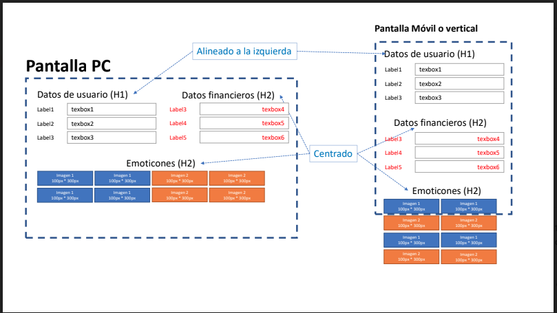
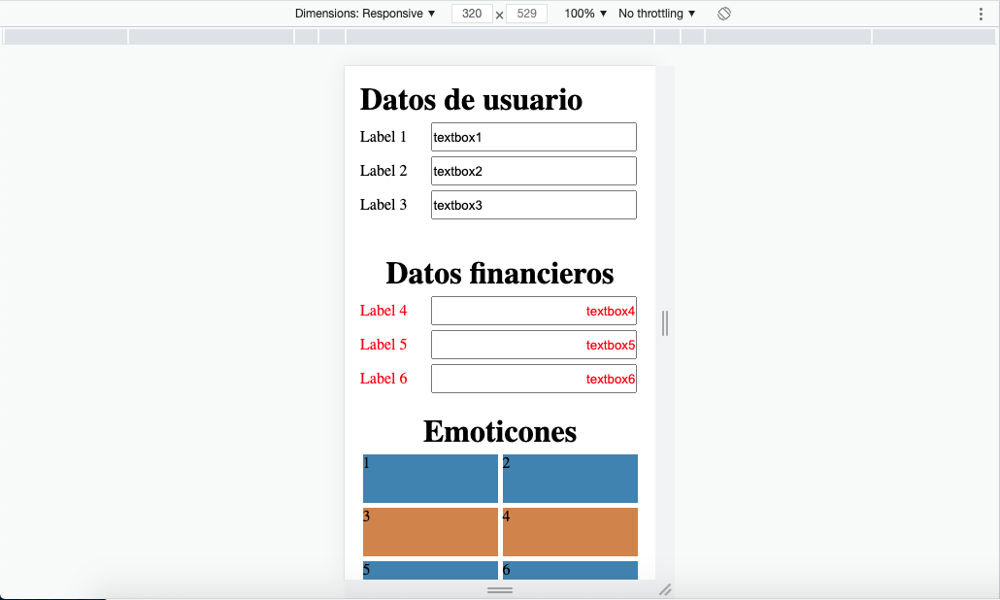
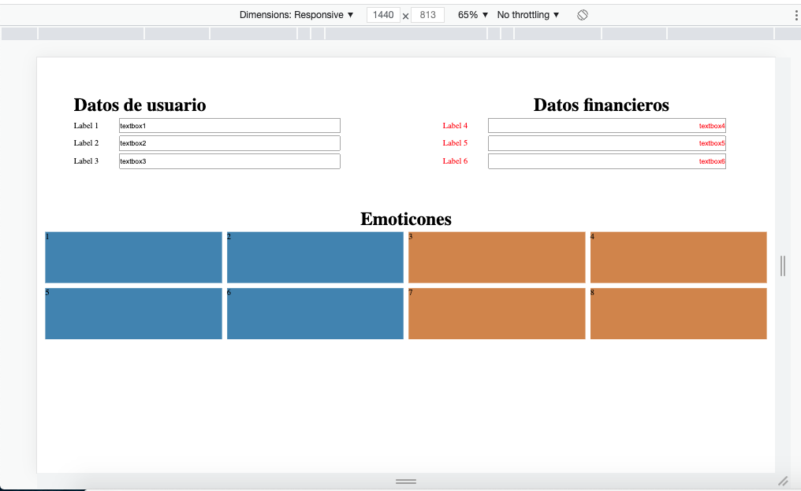

# Punto1_PuebaTecnica_Pangea

## Requisitos del punto 1

## Descripcion

Se realizo la maquetación de una pagina HTML responsiva utilizando la estrategia first mobile, con las etiquetas y caracteristicas solicitadas. Se hizo uso de CSS con para dar estilo y dinamica responsiva.

## modelo solicitado

## Solución

### Móvil

## Pc

